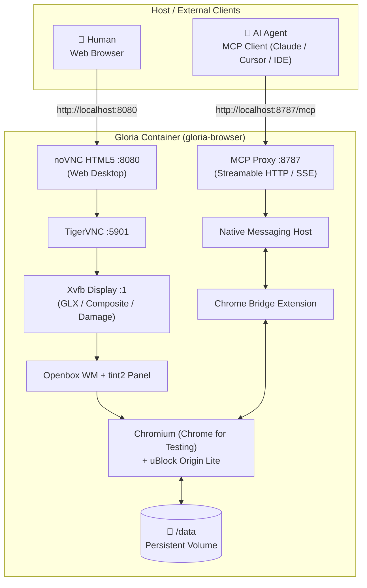

# Gloria

Gloria is a containerized, persistent Chromium workstation designed for concurrent human and AI agent operation. Humans access the browser desktop in real time via an HTML5 web interface (noVNC), while AI agents interact with the same browser process, profile, and DOM via the Model Context Protocol (MCP) and Chrome Bridge.

```
┌──────────────┐         noVNC (Port 8080)         ┌───────────────────────────────┐
│ Human User   ├──────────────────────────────────►│                               │
└──────────────┘                                   │  Shared Chromium Instance     │
                                                   │  • Shared DOM & Tab State     │
┌──────────────┐      MCP Endpoint (Port 8787)     │  • Shared Auth & Cookies      │
│ AI Agent     ├──────────────────────────────────►│  • Shared /data/profile       │
└──────────────┘                                   └───────────────────────────────┘
```

---

## Overview

Unlike headless browser scrapers or ephemeral automation sandboxes, Gloria runs a full, persistent browser workstation inside a single Docker container:

- **Shared State**: Both humans and AI agents interact with the exact same browser instance, tabs, cookies, and authenticated sessions.
- **Web Desktop (noVNC)**: Zero-friction HTML5 browser desktop accessible directly from any web browser without local client software.
- **AI Automation (MCP)**: Native Model Context Protocol (MCP) server powered by [Chrome Bridge](https://github.com/sh7vansh/chrome-bridge), enabling AI agents to read DOM snapshots, click elements, fill forms, execute scripts, and inspect network state.
- **Lightweight Desktop**: Powered by the Openbox window manager and tint2 panel, optimized for low memory footprint and high responsiveness.
- **Pre-installed Ad Blocking**: Ships with uBlock Origin Lite configured in Basic mode (declarative filtering) for clean, low-overhead browsing.
- **Data Persistence**: All profile data, authentication state, extensions, and downloads reside on a persistent Docker volume.

---

## Architecture

Gloria packages the browser, display server, desktop manager, VNC pipeline, and MCP interface into a unified, supervisor-managed container:



### Component Breakdown

| Component | Technology | Role |
|---|---|---|
| **Web Desktop** | noVNC + WebSockets | Exposes the virtual desktop to standard web browsers on port `8080`. |
| **VNC Server** | TigerVNC (`x0tigervncserver`) | Scrapes the X11 virtual display buffer with low latency. |
| **Display Server** | Xvfb (`:1`) | Virtual X11 display supporting composite and damage extensions at 60 fps. |
| **Window Manager** | Openbox + tint2 | Minimalist window management and taskbar for window switching and restore. |
| **Browser Engine** | Chromium (Chrome for Testing) | Runs persistent browser sessions with enterprise policy support. |
| **Content Blocker** | uBlock Origin Lite | Manifest V3 declarative ad/tracker blocking enabled in Basic mode. |
| **Automation Engine** | Chrome Bridge + Native Messaging | High-fidelity DOM introspection and interaction layer. |
| **Agent API** | MCP Proxy (`mcp-proxy`) | Translates MCP protocol requests to the Chrome Bridge native host. |
| **Process Manager** | supervisord | Supervises and restarts container services. |

---

## Quick Start

### Prerequisites

- Docker Engine 24.0+
- Docker Compose V2

### 1. Clone & Start

```bash
git clone https://github.com/sh7vansh/gloria.git
cd gloria
docker compose up -d
```

### 2. Connect

| Interface | Endpoint | Authentication | Description |
|---|---|---|---|
| **Web Desktop** | `http://localhost:8080` | None (Direct) | Interactive browser desktop for humans. |
| **MCP API** | `http://localhost:8787/mcp` | None (Local) | HTTP/SSE endpoint for AI agent integration. |
| **VNC Client** | `localhost:5901` | `gloria` | Optional native VNC viewer connection. |

---

## Human & AI Workflows

### 1. Human Interface (noVNC)
Navigate to `http://localhost:8080`. The browser window opens automatically within an Openbox environment. You can log into accounts, browse websites, solve CAPTCHAs, or download files. Any changes persist across container restarts.

### 2. AI Interface (MCP Client Configuration)
Add Gloria to your AI agent or MCP client configuration:

#### Claude Desktop (`claude_desktop_config.json`) / Cursor / Antigravity
```json
{
  "mcpServers": {
    "gloria": {
      "url": "http://localhost:8787/mcp"
    }
  }
}
```

#### Available MCP Tools
- `execute_python`: Execute automation scripts using the injected `chrome` SDK.
- `chrome.snapshot()`: Retrieve an accessible semantic outline and element map of the active tab.
- `chrome.click(target_id)`: Dispatch mouse clicks to targeted DOM elements.
- `chrome.type(target_id, text)`: Input text into form controls.
- `chrome.navigate(url)`: Navigate the active tab to a target URL.
- `chrome.screenshot()`: Capture viewport screenshots.

### 3. Co-Browsing Example
1. The human user opens a web service in Gloria and completes multi-factor authentication.
2. The AI agent connects via MCP, calls `chrome.snapshot()` to inspect the authenticated page state.
3. The AI agent performs automated data entry or workflow tasks using `chrome.click()` and `chrome.type()`.
4. The human watches the actions live on the noVNC desktop at `http://localhost:8080`.

---

## Storage & Persistence

Gloria stores all state on a named Docker volume (`gloria-data`) mounted at `/data`:

```
/data/
├── chromium/
│   └── profile/          # Full Chromium User Data Directory (cookies, logins, cache)
├── downloads/            # Linked to /home/gloria/Downloads
├── desktop/              # Linked to /home/gloria/Desktop
└── gloria/
    ├── config/           # Container configuration files
    ├── logs/             # Service logs (supervisord, chromium, mcp-proxy, novnc, vnc)
    └── state/            # Runtime IPC and session state
```

To back up or inspect state:
```bash
# View active service logs inside persistent storage
docker exec gloria-browser ls -la /data/gloria/logs/
```

---

## Configuration

Custom environment variables can be placed in a `.env` file at the repository root:

```bash
cp .env.example .env
```

| Variable | Default | Purpose |
|---|---|---|
| `GLORIA_WEB_PORT` | `8080` | Host port for noVNC Web Desktop |
| `GLORIA_MCP_PORT` | `8787` | Host port for MCP Proxy endpoint |
| `GLORIA_VNC_PORT` | `5901` | Host port for direct TigerVNC connections |
| `GLORIA_DISPLAY` | `:1` | X11 virtual display identifier |
| `GLORIA_SCREEN_WIDTH` | `1920` | Virtual desktop display width (px) |
| `GLORIA_SCREEN_HEIGHT` | `1080` | Virtual desktop display height (px) |
| `GLORIA_SCREEN_DEPTH` | `24` | Virtual desktop color depth (bits) |
| `GLORIA_DATA` | `/data` | Path to persistent storage inside container |
| `GLORIA_VNC_PASSWORD` | `gloria` | Password for direct VNC connections |

---

## Security & Deployment

> [!WARNING]
> The MCP endpoint (`http://localhost:8787/mcp`) is unauthenticated by default and grants full programmatic control over the live Chromium session and its authenticated cookies.

### Best Practices

- **Private Networking**: Do not expose ports `8080`, `8787`, or `5901` directly to public networks.
- **Access Control**: Place Gloria behind an authenticated reverse proxy (e.g., Caddy, Nginx with auth, or Tailscale / WireGuard VPN).
- **Container Isolation**: Chromium runs with `--no-sandbox` to operate inside standard container namespaces without elevated privileges. Ensure host Docker daemon security policies are enforced.

---

## Diagnostics & Management

### Diagnostic Script

Run the built-in diagnostic tool to verify environment readiness:

```bash
# On the host
./scripts/doctor.sh

# Inside the container
docker exec gloria-browser bash /opt/gloria/scripts/healthcheck.sh
```

### Inspecting Logs

```bash
# Docker container output
docker compose logs -f

# Service-specific log files
docker exec gloria-browser tail -f /data/gloria/logs/chromium.log
docker exec gloria-browser tail -f /data/gloria/logs/mcp-proxy.log
docker exec gloria-browser tail -f /data/gloria/logs/novnc.log
```

### Restarting or Resetting

```bash
# Restart services safely (persists data)
docker compose restart

# Full rebuild
docker compose build --no-cache
docker compose up -d

# Complete reset (destroys stored profile data)
docker compose down -v
```

---

## Architecture Decisions

### Why a single container?
Chromium, Xvfb, Openbox, TigerVNC, and noVNC require low-latency shared access to the X11 display socket (`:1`) and Unix domain IPC sockets. Packaging them in a single container managed by `supervisord` eliminates multi-container X11 forwarding overhead and networking complexity.

### Why Openbox and tint2?
Full desktop environments consume significant RAM and CPU cycles in headless containers. Openbox combined with tint2 provides essential window management, minimize/restore capabilities, and taskbar controls with an overhead of under 30MB of RAM.

### Why noVNC over heavy gateway software?
noVNC runs directly via WebSockets and HTML5 canvas, providing instant, clientless web desktop access with zero login friction, dynamic scaling, and minimal latency.

### Why Chrome Bridge with Native Messaging?
Chrome Bridge interfaces directly with Chrome's native messaging protocol and Manifest V3 extension APIs. This enables persistent, full-fidelity control of an authentic user browser session rather than an artificial, detectable synthetic browser instance.

---

## Dependencies & Credits

- [Chrome Bridge](https://github.com/sh7vansh/chrome-bridge) — Native messaging automation engine & MCP server
- [uBlock Origin Lite](https://github.com/uBlockOrigin/uBOL-home) — Manifest V3 declarative content blocker
- [noVNC](https://novnc.com/) — HTML5 VNC client
- [TigerVNC](https://tigervnc.org/) — High-performance VNC server
- [Openbox](http://openbox.org/) — Lightweight X11 window manager
- [tint2](https://gitlab.com/o9000/tint2) — Lightweight X11 taskbar
- [mcp-proxy](https://pypi.org/project/mcp-proxy/) — SSE / Streamable HTTP MCP proxy
- [uv](https://docs.astral.sh/uv/) — Fast Python packaging and tool management

---

## License

MIT — see [LICENSE](LICENSE).

