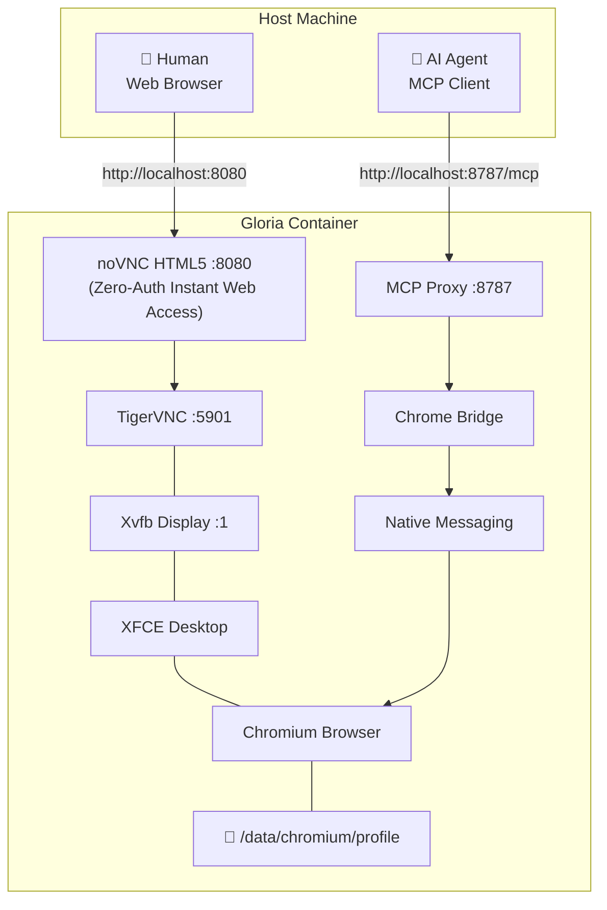

# Gloria

**Gloria is a self-hosted Dockerized Chromium workstation that lets humans access a persistent browser through a web desktop while AI agents control the same browser remotely through MCP.**

```
Human ──── noVNC (Port 8080) ────┐
                                 ├──▶ Same Chromium ──▶ Same Profile
AI Agent ── MCP (Port 8787) ─────┘
```

## Architecture

Gloria runs a single, lightweight container:



| Component | Role |
|-----------|------|
| **Chrome Bridge** | Browser control engine — Python SDK, Native Messaging host, MCP server |
| **Gloria** | Infrastructure — packages Chromium, Chrome Bridge, XFCE, VNC, noVNC, and MCP Proxy |

## Quick Start

```bash
git clone https://github.com/sh7vansh/Gloria.git
cd Gloria
docker compose up -d
```

Gloria bootstraps everything automatically:
- Ubuntu + XFCE desktop
- Chromium with persistent profile
- Chrome Bridge extension + Native Messaging
- noVNC zero-login HTML5 web desktop
- MCP Proxy (AI interface)

### Access Points

| Interface | URL | Authentication | Purpose |
|-----------|-----|----------------|---------|
| **Web Desktop** | http://localhost:8080 | **None (Zero Login)** | Instant human browser access |
| **MCP API** | http://localhost:8787/mcp | **None** | AI agent interface |
| **Direct VNC** | vnc://localhost:5901 | **None** | Native VNC viewer access |

## Human Access

Open **`http://localhost:8080`** in any web browser. You'll immediately see the live Chromium desktop with **zero login screens, usernames, or passwords**.

```
Your Browser → noVNC (Port 8080) → TigerVNC → XFCE → Chromium
```

Everything you see is the **real** Chromium instance. Navigate, click, log in — it all persists across container restarts.*real** Chromium instance. Navigate, click, log in — it all persists.

## AI / MCP Access

Connect any MCP-compatible client to:

```
http://localhost:8787/mcp
```

### Example MCP client configuration

```json
{
  "mcpServers": {
    "gloria": {
      "url": "http://localhost:8787/mcp"
    }
  }
}
```

The AI agent gets access to Chrome Bridge tools:
- `execute_python` — run Python code with the injected `chrome` SDK
- `chrome.snapshot()` — get a semantic outline of the current page
- `chrome.click(id)` — click an element by reference ID
- `chrome.type(id, text)` — type into an input field
- `chrome.navigate(url)` — navigate to a URL
- `chrome.screenshot()` — capture a screenshot
- And more (see [Chrome Bridge docs](https://github.com/sh7vansh/chrome-bridge))

## Shared Browser Session

This is Gloria's core feature. Both interfaces operate on the **exact same Chromium process and profile**:

```
┌──────────────────────────────────────────────────────┐
│                   Same Chromium                      │
│                   Same Profile                       │
│                   Same Tabs                          │
│                   Same Cookies                       │
│                   Same Session                       │
├──────────────────────────────────────────────────────┤
│ Human sees ◄──────── screen ────────► AI controls    │
│ via Guacamole                        via MCP         │
└──────────────────────────────────────────────────────┘
```

**Example workflow:**
1. Human opens YouTube in Chromium via Guacamole
2. AI calls `chrome.snapshot()` → sees YouTube
3. AI calls `chrome.click(14)` → clicks a video
4. Human sees the video start playing instantly

## Persistent Storage

Gloria uses a Docker volume (`gloria-data`) mounted at `/data`:

```
/data/
├── chromium/
│   └── profile/          # Full Chromium user data directory
├── downloads/            # Browser downloads
├── desktop/              # Desktop files
└── gloria/
    ├── config/           # Gloria configuration
    ├── logs/             # Service logs
    └── state/            # Runtime state
```

**Everything survives container recreation:**
- Cookies & authentication state
- Local storage & IndexedDB
- Browser history & bookmarks
- Tab sessions (where Chromium supports it)
- Extensions & settings
- Downloads

```bash
# Safe restart — all data preserved
docker compose down
docker compose up -d
```

## Configuration

Copy `.env.example` to `.env` to customize:

```bash
cp .env.example .env
```

| Variable | Default | Description |
|----------|---------|-------------|
| `GLORIA_DISPLAY` | `:1` | X11 display number |
| `GLORIA_SCREEN_WIDTH` | `1920` | Desktop resolution width |
| `GLORIA_SCREEN_HEIGHT` | `1080` | Desktop resolution height |
| `GLORIA_SCREEN_DEPTH` | `24` | Color depth |
| `GLORIA_VNC_PORT` | `5901` | VNC port (internal) |
| `GLORIA_MCP_PORT` | `8787` | MCP Proxy port (exposed) |
| `GLORIA_GUAC_PORT` | `8080` | Guacamole web port (exposed) |
| `GLORIA_DATA` | `/data` | Persistent data mount point |
| `GLORIA_VNC_PASSWORD` | `gloria` | VNC password |

## Security

> [!CAUTION]
> **The MCP endpoint is a privileged interface.** Anyone who can reach port 8787 can control a real browser with real authentication state. Treat it like SSH access.

### Recommendations

- **Never expose MCP publicly** without authentication
- Deploy behind a **VPN, SSH tunnel, or authenticated reverse proxy**
- VNC is not exposed to the host by default — Guacamole is the human-facing layer
- Change default passwords in production
- Consider network-level access controls

### What is NOT protected in v0.1

- MCP has no built-in authentication (rely on network isolation)
- Guacamole uses simple XML-based credentials
- The Chromium instance runs with `--no-sandbox` (required inside Docker)

For production deployments, use:
```
VPN → Gloria
```
or:
```
Reverse Proxy (with auth) → Gloria
```

## Services

| Service | Image | Purpose |
|---------|-------|---------|
| `gloria-browser` | Custom (Ubuntu 24.04) | XFCE + Chromium + Chrome Bridge + VNC + MCP Proxy |
| `gloria-guacd` | `guacamole/guacd:1.5.5` | Guacamole connection daemon |
| `gloria-guacamole` | `guacamole/guacamole:1.5.5` | Guacamole web application |

## Troubleshooting

### Health Check

```bash
# From the host machine
./scripts/doctor.sh

# From inside the container
docker exec gloria-browser bash /opt/gloria/scripts/healthcheck.sh
```

Expected output:
```
Gloria
────────────────────────────────
  ✓ Desktop        Xvfb running on :1
  ✓ VNC            listening on port 5901
  ✓ Chromium       running (PID: 1234)
  ✓ Profile        /data/chromium/profile
  ✓ Extension      /home/gloria/.chrome-bridge/extension
  ✓ Native Host    manifest OK, launcher executable
  ✓ Chrome Bridge  IPC socket active
  ✓ MCP Proxy      listening on port 8787

All checks passed.
```

### Common Issues

| Issue | Solution |
|-------|----------|
| Guacamole shows blank screen | Wait 30s for XFCE to fully start, then refresh |
| MCP connection refused | Check `docker logs gloria-browser` for MCP Proxy errors |
| Chromium won't start | Check `docker exec gloria-browser cat /data/gloria/logs/chromium.err` |
| Extension not loaded | Verify with `docker exec gloria-browser ls /home/gloria/.chrome-bridge/extension/` |
| VNC not connecting | Check VNC logs: `docker exec gloria-browser cat /data/gloria/logs/vnc.err` |

### View Logs

```bash
# All service logs
docker compose logs -f

# Specific service
docker logs gloria-browser -f

# Internal service logs
docker exec gloria-browser cat /data/gloria/logs/chromium.log
docker exec gloria-browser cat /data/gloria/logs/mcp-proxy.log
docker exec gloria-browser cat /data/gloria/logs/xfce.log
```

### Run Tests

```bash
./scripts/test.sh
```

## Development

### Rebuild after changes

```bash
docker compose build --no-cache
docker compose up -d
```

### Access container shell

```bash
docker exec -it gloria-browser bash
```

### Reset everything

```bash
# Stop and remove volumes (destroys all data!)
docker compose down -v
docker compose up -d
```

## Architecture Decisions

### Why one container for browser + desktop + VNC?

Chromium must be visible through VNC to the human. This requires Chromium, XFCE, Xvfb, and VNC to share the same X11 display (`:1`). Splitting them across containers would require complex X11 forwarding. A single container with `supervisord` is the pragmatic choice.

### Why Guacamole instead of raw VNC?

VNC requires a VNC client. Guacamole provides browser-based access — any device with a web browser can connect. This matches Gloria's goal of being remotely accessible.

### Why `--load-extension` instead of Chrome Web Store?

Chrome Bridge's extension uses `nativeMessaging` permission and connects to a local Native Messaging host. The extension is tightly coupled to the local Chrome Bridge installation. Using `--load-extension` ensures the exact extension version matches the installed Chrome Bridge version.

### Why supervisord?

The browser container runs multiple long-lived processes (Xvfb, XFCE, VNC, Chromium, MCP Proxy). Supervisord handles process lifecycle, restart policies, and log management. It's lighter than systemd and works well in containers.

### Why not Playwright/Selenium?

Gloria is not a browser automation framework. Chrome Bridge is the control layer, and it uses Chrome's Native Messaging API — a first-party Chrome extension API. This operates against the user's real browser session rather than a separate automation browser.

## Dependencies

- [Chrome Bridge](https://github.com/sh7vansh/chrome-bridge) — Browser control engine
- [Apache Guacamole](https://guacamole.apache.org/) — Remote desktop gateway
- [TigerVNC](https://tigervnc.org/) — VNC server
- [XFCE](https://xfce.org/) — Desktop environment
- [uv](https://docs.astral.sh/uv/) — Python package manager
- [mcp-proxy](https://pypi.org/project/mcp-proxy/) — MCP SSE/streamable-HTTP proxy

## License

MIT — see [LICENSE](LICENSE).
